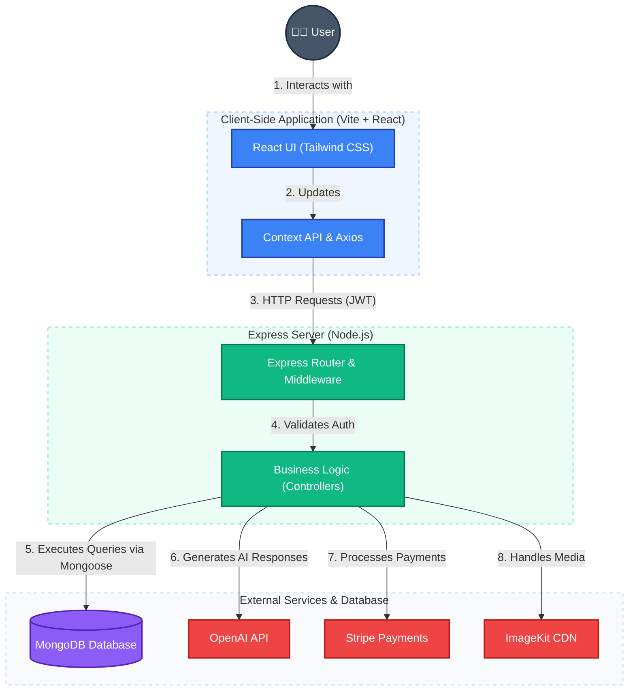

# Thinkmate

Thinkmate is an AI-powered conversational assistant and creative platform. It offers an intelligent chat interface capable of rich markdown responses and a community space where users can explore published AI-generated content. With an integrated credits system, users can manage their usage and unlock advanced capabilities seamlessly.

## 🚀 Features

### For Users
- **Intelligent Chat:** Engage in rich, interactive conversations powered by advanced OpenAI models.
- **Code & Markdown Support:** Enjoy beautifully formatted responses with syntax highlighting via Prism.js and React Markdown.
- **Community Gallery:** Browse, publish, and explore AI-generated images within the community.
- **Credits Management:** Monitor your AI usage credits and seamlessly purchase more through Stripe integration.
- **Dark Mode:** A sleek, fully responsive UI that adapts to your theme preferences.

## 🛠️ Tech Stack

- **Frontend:** [React 19](https://react.dev/) (via [Vite](https://vitejs.dev/))
- **Styling:** [Tailwind CSS 4](https://tailwindcss.com/)
- **Backend:** [Node.js](https://nodejs.org/) & [Express](https://expressjs.com/)
- **Database:** [MongoDB](https://www.mongodb.com/) & [Mongoose](https://mongoosejs.com/)
- **Authentication:** Custom JWT-based Authentication
- **Payments:** [Stripe](https://stripe.com/)
- **AI Integration:** [OpenAI SDK](https://openai.com/)
- **Media Storage:** [ImageKit](https://imagekit.io/)

## 🏗️ Architecture & How It Works

Thinkmate follows a classic decoupled Full-Stack architecture with a React Single Page Application (SPA) communicating with an Express RESTful API.



### 1. User Interaction & Client Layer (Blue)
The frontend is built using **React** and powered by **Vite** for blazing fast performance.
- The user interfaces are styled with **Tailwind CSS**.
- State management and API communication are handled via the React Context API and **Axios**.
- Responses containing code are formatted automatically using `react-markdown` and `prismjs`.

### 2. Express Backend & API (Green)
The backend acts as a robust RESTful API built with **Express.js**.
- All requests are routed through custom middleware to verify JSON Web Tokens (JWT) for secure endpoints.
- Controllers separate the core business logic, handling user registration, chat histories, image fetching, and payment processing.

### 3. Database Layer (Purple)
Data persistence is handled by **MongoDB**.
- **Mongoose** is used as an ODM to ensure strict schemas for Users, Chats, Messages, and Credits.

### 4. Third-Party Integrations (Red)
- **OpenAI:** Powers the core conversational intelligence.
- **Stripe:** Securely manages user credit purchases and transactions.
- **ImageKit:** Optimizes and serves user-published images for the Community gallery.

## 📂 Folder Structure

```text
Thinkmate/
├── client/          # React Frontend application
│   ├── src/
│   │   ├── assets/     # Static assets and icons
│   │   ├── components/ # Reusable React components (Sidebar, ChatBox)
│   │   ├── context/    # Global state management
│   │   └── pages/      # Route pages (Login, Credits, Community)
│   └── package.json    # Frontend dependencies
├── server/          # Express Backend application
│   ├── configs/        # Environment and DB configuration
│   ├── controllers/    # Business logic for routes
│   ├── middleware/     # Custom auth & error middleware
│   ├── models/         # Mongoose database schemas
│   ├── routes/         # Express API route definitions
│   ├── server.js       # Main server entrypoint
│   └── package.json    # Backend dependencies
└── README.md
```

## ⚙️ Getting Started

### Prerequisites
Make sure you have [Node.js](https://nodejs.org/) and [MongoDB](https://www.mongodb.com/) installed on your machine.

### Installation

1. **Clone the repository:**
   ```bash
   git clone https://github.com/your-username/Thinkmate.git
   cd Thinkmate
   ```

2. **Set up the Server:**
   ```bash
   cd server
   npm install
   ```
   Create a `.env` file in the `server` directory and add your keys:
   ```env
   PORT=5000
   MONGODB_URI=your_mongo_uri
   JWT_SECRET=your_jwt_secret
   OPENAI_API_KEY=your_openai_key
   STRIPE_SECRET_KEY=your_stripe_key
   IMAGEKIT_PUBLIC_KEY=your_imagekit_public
   IMAGEKIT_PRIVATE_KEY=your_imagekit_private
   IMAGEKIT_URL_ENDPOINT=your_imagekit_endpoint
   ```
   Start the backend:
   ```bash
   npm run server
   ```

3. **Set up the Client:**
   Open a new terminal and navigate to the client folder:
   ```bash
   cd client
   npm install
   ```
   Create a `.env` file in the `client` directory (if required) for your API URL:
   ```env
   VITE_BACKEND_URL=http://localhost:5000
   ```
   Start the frontend:
   ```bash
   npm run dev
   ```

4. **Explore the App:**
   Open [http://localhost:5173](http://localhost:5173) in your browser to view the application.

## 🤝 Contributing
Contributions, issues, and feature requests are welcome! Feel free to check the issues page if you want to contribute.
